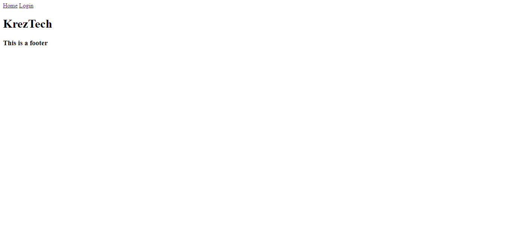

# KrezTech 
    
## Description
KrezTech is a new online blog website where tech geeks from all around the world can connect to ask questions, share ideas and make friends!  

    
## Installation
Type: 'npm i express-handlebars mysql2 sequelize dotenv bcrypt ezpress-session connect-session-sequelize' into the console, then hit enter.
    
To run the application type: npm start into the console, then hit enter.
    
## Testing
To run tests, type: n/s in the console, then hit enter.
        
# Questions
## [krezket](https://github.com/krezket) 
https://kreztech.herokuapp.com/
